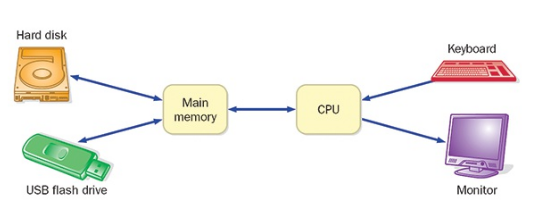

# Introduction

### Chapter Objectives

#### Hardware
- Identify core hardware components, and their roles
- Explain how computer hardware components interact to execute programs and manage data
- Describe how computers are connected into networks to share information

#### Software
- Define various types of software and how they're used
- Introduce the Java programming language
- Describe the steps involved in program compilation and execution
- Present an overview of object-oriented principles

#### Prologue
This book is about writing well-designed software. Understanding software requires understanding how it interacts with the computer system. Understanding the purpose of hardware components and their network connection are important prerequisites to studying software development. Hardware and software cooperate in computers to accomplish complex tasks.

#### Chapter Overview
This chapter first discusses:
- basic computer processing
- software development
    - Java programming language
    - Object-oriented programming

## Computer Processing

#### Computer System Characteristics
All computer systems:
- share certain characteristics.
- process data similarly

A computer system made up of:

1. *Hardware*
    - Physical, touchable pieces that support the computing effort
        - Include:
            - chips
            - boxes
            - wires
            - keyboards
            - speakers
            - disks
            - memory cards
            - universal serial bus (USB)
                - flash drives
            - cables
            - plugs
            - printers
            - mice
            - monitors
            - routers

2. *Software*
    - Intangible tools of computing
    - Consists of *programs* and data that programs use.
    - *Program*
        - Series of instructions hardware executes one-after-another
     
##### Key Concept
A computer system consists of hardware and software that work in concert to help us solve problems.
     
#### Key Hardware Components
Key hardware components in a computer system are:

- **central processing unit (CPU)**
    - executes individual commands of a program

- **input/output (I/O) devices**
    - allows human beings to interact with a computer
        - "peripheral devices" are an example
            - mouse, keyboard, etc.

- **main memory**
    - storage device that holds software while it is processed by the CPU

- **secondary memory devices**
    - storage device that holds software in a relatively permanent manner.
        - *hard disk drive* (HDD)
            - most important secondary memory device
        - *universal serial bus (USB) flash drive*
            - cannot store nearly as much information as an HDD
            - portable
                - removable temporarily or computer-to-computer
             
#### Program Execution Process

How does information move along basic computer hardware components?
Figure 1.1 shows how.

**Program Execution Process** is as follows:
- Executable program is chosen
- Program is stored on secondary memory device
- Program is run
    - Copy of program is brought from secondary memory and stored in main memory
    - CPU executes instructions one-by-one until program ends
    - Data that instructions use are also stored in main memory
        - Brought from secondary memory, or read from input device (e.g. keyboard)
    - Output may be displayed on an output device (e.g. monitor)

##### Key Concept
The CPU reads program instructions from main memory, executing them one-by-one until program ends

### Software Categories
- Software can be classified in various ways
- Main difference is between *system programs* (here i.e., *operating systems*) and *application programs*.

#### Operating systems
- core software of the computer
- The OS's job is to:
  1. make the computer easy to use
  2. ensure the computer runs efficiently

- Functions:
      1. Provides *user interface*
          - Allows users to interact with the machine
      2. Manages computer resources
          - Resources like CPU and main memory
          - Determines:
              - when programs are allowed to run
              - where programs are loaded into memory
              - how hardware devices communicate

##### Key Concept
The operating system provides a user interface and manages computer resources

#### Operating system market
- Desktop
    - Windows
    - Mac
    - GNU/Linux

- Mobile
    - iOS
    - Android

#### Applications
- *Application* ("app") is the generic term for any software other than the operating system
    - has its own interface
        - allows user to interact with said program
    - 